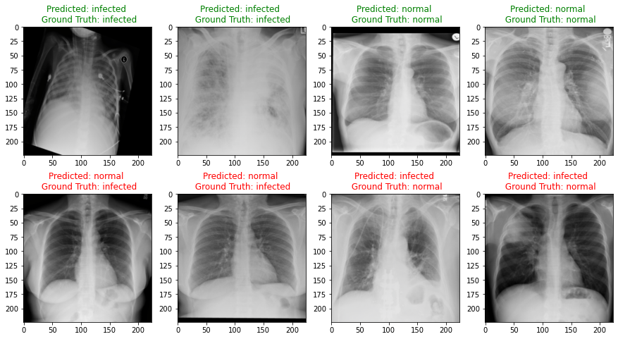

# MSDS19078_COVID19_DLSpring2020
This repository contains code and results for COVID-19 classification assignment by Deep Learning Spring 2020 course offered at Information Technology University, Lahore, Pakistan. This assignment is only for learning purposes and is not intended to be used for clinical purposes.

# Part 1

# Dataset
Dataset used for this assignment can be found [here](https://drive.google.com/open?id=1-HQQciKYfwAO3oH7ci6zhg45DduvkpnK).

https://drive.google.com/open?id=1-HQQciKYfwAO3oH7ci6zhg45DduvkpnK

# Task 1 - A: Fine Tune only FC Layers of VGG16
In this task FC layers are replaced with 2 custom layers and all feature layers are freezed then trained model on given dataset.
```
Train Accuracy: 0.9414 | F1 Score: 0.9508
Validation Accuracy: 0.8980 | F1 Score: 0.9133
Test Accuracy: 0.9553 | F1 Score: 0.9626
```


## Predictions


---


# Task 1 - B: Fine Tune only FC Layers of ResNet18
In this task FC layers are replaced with 2 custom layers and all feature layers are freezed then trained model on given dataset.
```
Train Accuracy: 0.9028 | F1 Score: 0.9204
Validation Accuracy: 0.8767 | F1 Score: 0.8976
Test Accuracy: 0.9360 | F1 Score: 0.9470
```


## Predictions


---
# Task 2 - A: Fine Tune entire VGG16
In this task FC layers are replaced with 2 custom layers and all feature layers are unfreezed then trained model on given dataset.
```
Train Accuracy: 0.9751 | F1 Score: 0.9789
Validation Accuracy: 0.9260 | F1 Score: 0.9373
Test Accuracy: 0.9793 | F1 Score: 0.9825
```


## Predictions


---

# Task 2 - B: Fine Tune entire ResNet18
In this task FC layers are replaced with 2 custom layers and all feature layers are unfreezed then trained model on given dataset.
```
Train Accuracy: 0.9810 | F1 Score: 0.9840
Validation Accuracy: 0.9240 | F1 Score: 0.9360
Test Accuracy: 0.9713 | F1 Score: 0.9759
```


## Predictions


---

# Trained Models 
Weights of trained models can be found [here](https://drive.google.com/drive/folders/1wUg1gCygCSDe23Gnr8DKXVBpzHwPYACF?usp=sharing)

https://drive.google.com/drive/folders/1wUg1gCygCSDe23Gnr8DKXVBpzHwPYACF?usp=sharing


# Part 2


# Dataset
Dataset used for Part 2 can be found [here](https://drive.google.com/open?id=1eytbwaLQBv12psV8I-aMkIli9N3bf8nO).

https://drive.google.com/open?id=1eytbwaLQBv12psV8I-aMkIli9N3bf8nO

# Task 1 - A: Cross Entropy Loss
In this task two models VGG16 and ResNet18 were fully trained on given dataset using Cross Entropy Loss Function.

## VGG16
```
Train Accuracy: 97.03 | F1 Score: 97.17
Validation Accuracy: 96.13 | F1 Score: 96.34
```

### Training Confusion Matrix
Seperate confusion matrices are display for each class.
1. For COVID-19 class 182 samples were predicted correct.
2. For Normal class, 3913 samples were predicted correct.
3. For Pneumonia class, 2120 samples were predicted corrrect.

*1-1 means sample belongs to given class, 0-0 means sample belongs to other classes.
### Validation Confusion Matrix
Seperate confusion matrices are display for each class.
1. For COVID-19 class 22 samples were predicted correct.
2. For Normal class, 392 samples were predicted correct.
3. For Pneumonia class, 213 samples were predicted corrrect.


### Accuracy and Loss Curves


---

## ResNet18
```
Train Accuracy: 97.48 | F1 Score: 97.53
Validation Accuracy: 95.28 | F1 Score: 95.46
```

### Training Confusion Matrix
Seperate confusion matrices are display for each class.
1. For COVID-19 class 195 samples were predicted correct.
2. For Normal class, 3948 samples were predicted correct.
3. For Pneumonia class, 2101 samples were predicted corrrect.

*1-1 means sample belongs to given class, 0-0 means sample belongs to other classes.
### Validation Confusion Matrix
Seperate confusion matrices are display for each class.
1. For COVID-19 class 22 samples were predicted correct.
2. For Normal class, 392 samples were predicted correct.
3. For Pneumonia class, 208 samples were predicted corrrect.


### Accuracy and Loss Curves


---

# Task 1 - B: Focal Loss
In this task two models VGG16 and ResNet18 were fully trained on given dataset using Focal Loss.

## VGG16
```
Train Accuracy: 95.83 | F1 Score: 95.96
Validation Accuracy: 95.30 | F1 Score: 95.58
```

### Training Confusion Matrix
Seperate confusion matrices are display for each class.
1. For COVID-19 class 176 samples were predicted correct.
2. For Normal class, 3879 samples were predicted correct.
3. For Pneumonia class, 2079 samples were predicted corrrect.

*1-1 means sample belongs to given class, 0-0 means sample belongs to other classes.
### Validation Confusion Matrix
Seperate confusion matrices are display for each class.
1. For COVID-19 class 18 samples were predicted correct.
2. For Normal class, 392 samples were predicted correct.
3. For Pneumonia class, 210 samples were predicted corrrect.


### Accuracy and Loss Curves


---

## ResNet18
```
Train Accuracy: 96.11 | F1 Score: 96.23
Validation Accuracy: 94.93 | F1 Score: 95.10
```

### Training Confusion Matrix
Seperate confusion matrices are display for each class.
1. For COVID-19 class 191 samples were predicted correct.
2. For Normal class, 3940 samples were predicted correct.
3. For Pneumonia class, 2032 samples were predicted corrrect.

*1-1 means sample belongs to given class, 0-0 means sample belongs to other classes.
### Validation Confusion Matrix
Seperate confusion matrices are display for each class.
1. For COVID-19 class 22 samples were predicted correct.
2. For Normal class, 390 samples were predicted correct.
3. For Pneumonia class, 207 samples were predicted corrrect.


### Accuracy and Loss Curves


---

# Trained Models 
Weights of trained models for Part 2 can be found [here](https://drive.google.com/drive/folders/1wUg1gCygCSDe23Gnr8DKXVBpzHwPYACF?usp=sharing)

https://drive.google.com/drive/folders/1wUg1gCygCSDe23Gnr8DKXVBpzHwPYACF?usp=sharing